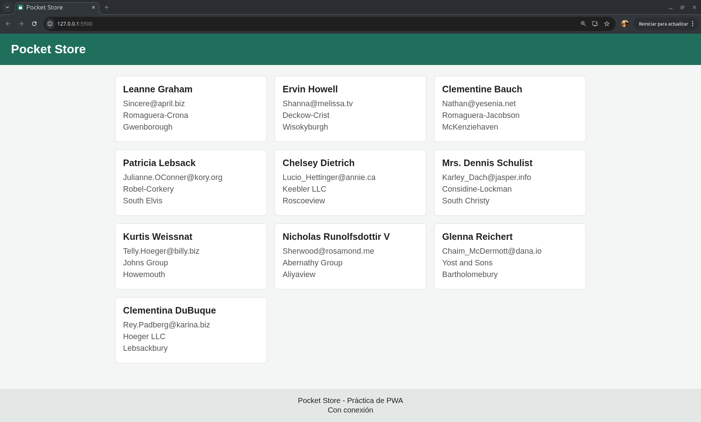
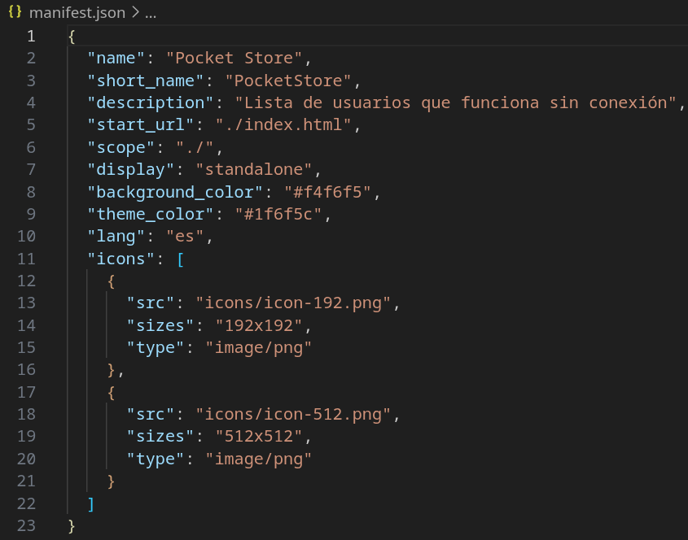
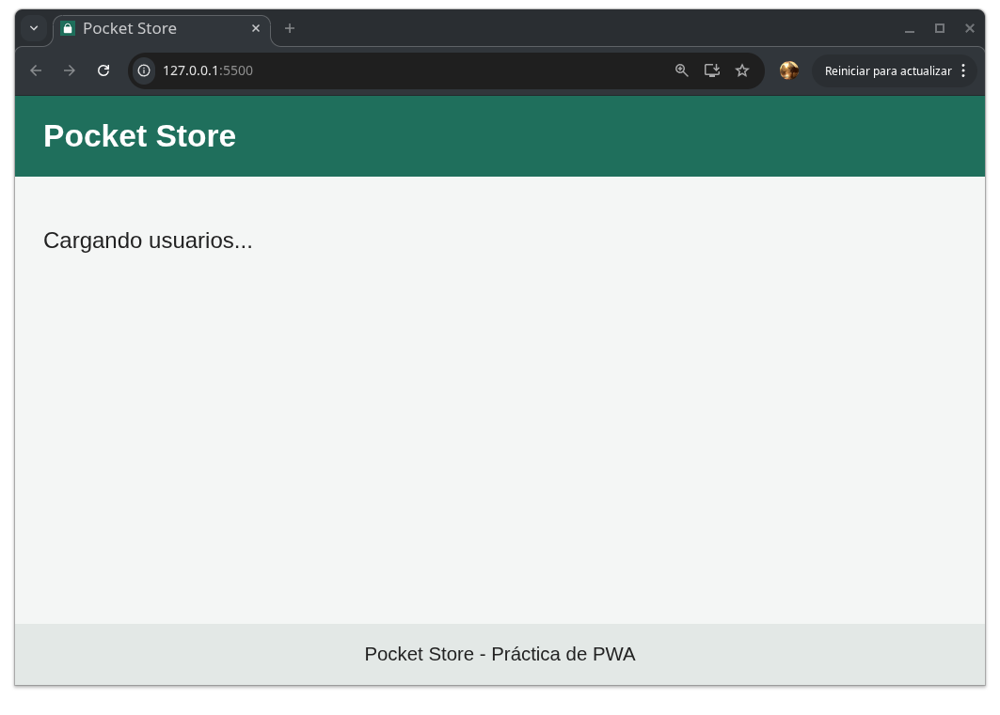
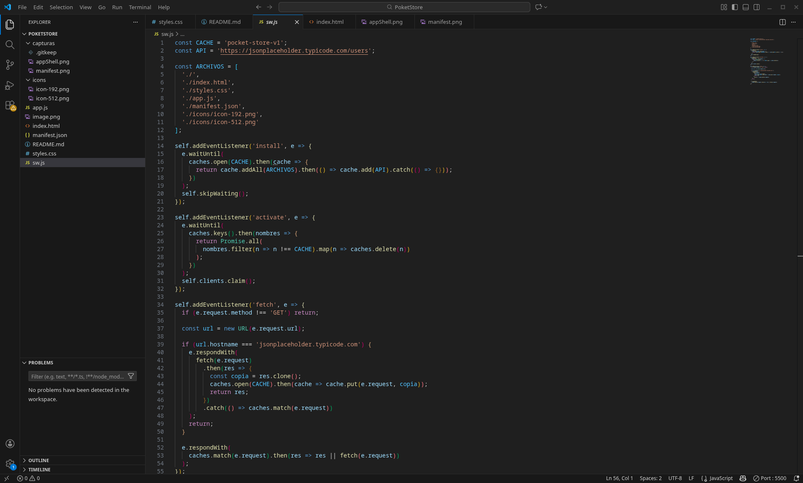
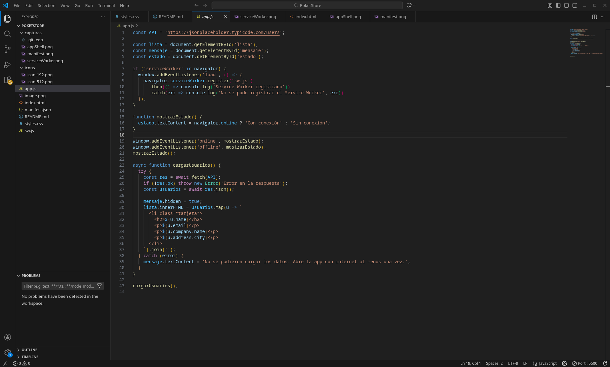
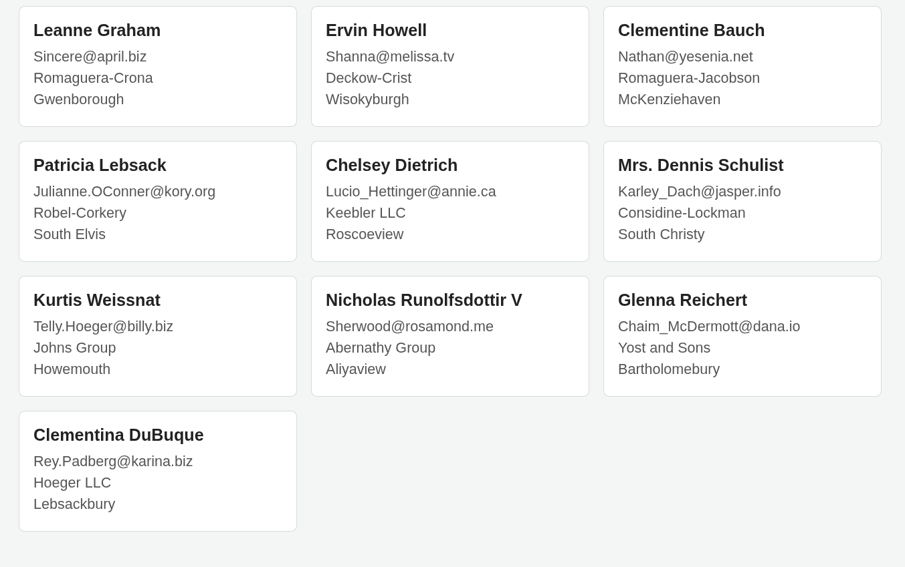
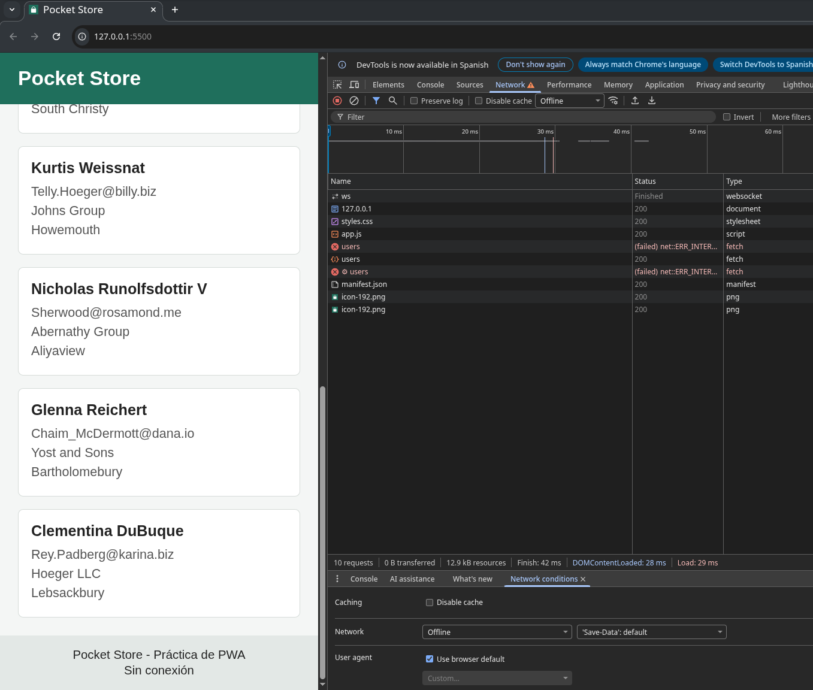

# Pocket Store

Aplicación web de una sola página (PWA) que muestra una lista de usuarios obtenida de la API pública [JSONPlaceholder](https://jsonplaceholder.typicode.com/) y que sigue funcionando cuando no hay internet.

## Estructura

```
pocket-store/
├── index.html      Vista (App Shell)
├── styles.css      Estilos del App Shell
├── app.js          Lógica de la app y registro del Service Worker
├── sw.js           Service Worker y caché
├── manifest.json   Manifiesto de instalación
├── icons/          Iconos de 192x192 y 512x512
└── capturas/       Imágenes del proceso de desarrollo
```

## Cómo ejecutarlo

Los Service Workers no funcionan abriendo el archivo directo (`file://`), así que hay que servir la carpeta con un servidor local. Desde la carpeta del proyecto. Para esto se utiliza la extencion de Live Server

Después se abre `http://127.0.0.1:5500/` en Chrome o Edge.


## Cómo se hizo

### 1. Manifiesto (manifest.json)

Lo escribí a mano con `name`, `short_name`, `start_url`, `display: "standalone"`, el color de fondo, el color del tema (`#1f6f5c`) y dos iconos (192x192 y 512x512). Con esto el navegador permite instalar la app.



### 2. App Shell (index.html y styles.css)

El HTML tiene solo lo fijo: una barra superior con el título, un contenedor principal y un pie de página. Como no depende de ninguna petición, carga al instante. La lista de usuarios se llena después desde JavaScript.



### 3. Service Worker (sw.js)

Programé los tres eventos del ciclo de vida:

- `install`: guarda en caché los archivos del App Shell y también la respuesta de la API.
- `activate`: borra las cachés de versiones anteriores.
- `fetch`: intercepta las peticiones.
  - Para los archivos propios usa caché primero y, si no está, va a la red.
  - Para la API usa red primero y guarda una copia; si no hay internet, responde con la última copia guardada.



### 4. Contenido dinámico (app.js)

Con `fetch()` se piden los usuarios a `https://jsonplaceholder.typicode.com/users` y se pintan como tarjetas (nombre, correo, empresa y ciudad). También se registra el Service Worker y en el pie de página se muestra si hay conexión o no.




## Cómo probar que funciona sin internet

1. Abrir la app con internet para que se guarde todo en caché.
2. Abrir DevTools, ir a Application, luego Service Workers y marcar Offline.
3. Recargar la página: la vista y la lista siguen apareciendo.




